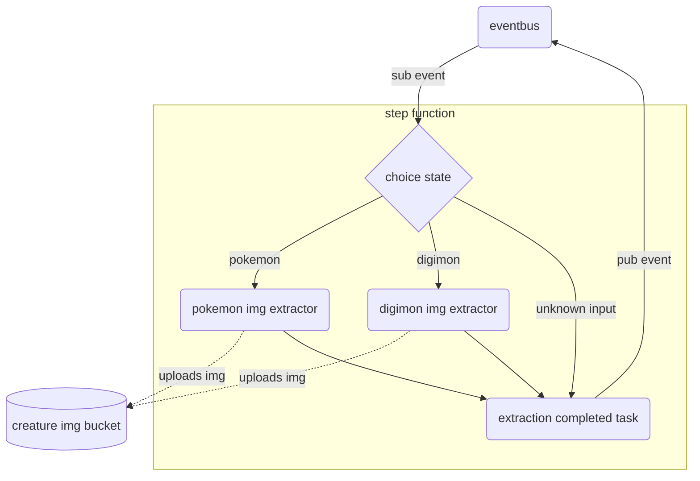

⚠️ Disclaimer: This service is a work in progress used to learn and explore AWS CDK features and is not intended to be used in
production (a.k.a. the code is shit, I'm just messing around)

# CDK Media Extraction POC

Pokémon™️ and Digimon™️ media assets extraction service

## Architecture

The service is subscribed to a media extraction event.

When the event is received the service extracts an image from [Pokémon](https://pokeapi.co/) and
[Digimon](https://digimon-api.vercel.app/) public API services and uploads it to an S3 bucket.

## Development

The `cdk.json` file tells the CDK Toolkit how to execute your app.

### Useful commands

* `npm run tc`              perform ts type-check
* `npm run build`           compile typescript to js in dist folder
* `npm run test`            perform the jest unit tests
* `npm run cdk deploy`      deploy this stack to your default AWS account/region
* `npm run cdk diff`        compare deployed stack with current state
* `npm run cdk synth`       emits the synthesized CloudFormation template

## TODO:

- [x] Add S3 storage to infra
- [x] Add Pokemon media extractor
    - [x] Add Pokemon API integration
    - [x] Add S3 integration
- [ ] Add Digimon media extractor
  - [ ] Add Digimon API integration
  - [ ] Add S3 integration
- [x] Add lambda handler for pokemon media extraction
- [ ] Add lambda handler for pokemon media extraction
- [ ] Add step function
  - [ ] Lambda choice step
  - [ ] Media extraction completed task
- [ ] Add EventBridge Integration 
- [ ] Add datadog integration (lambda construct extension or using _CDK Aspects_)